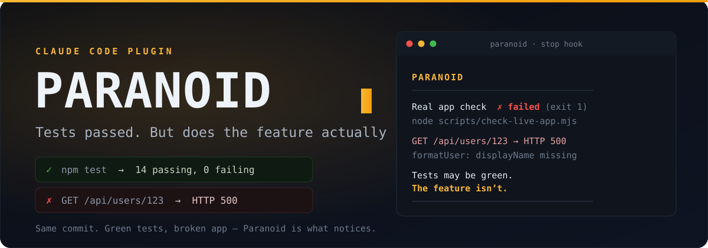
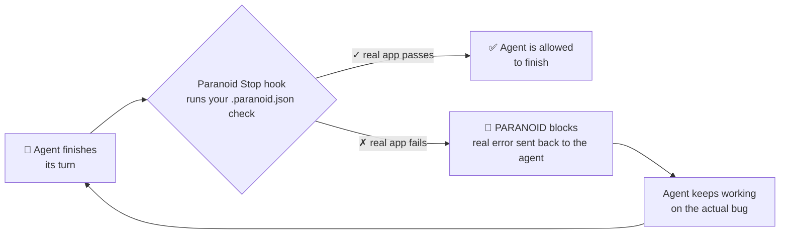

<p align="center">
  
</p>

<p align="center">
  <a href="https://github.com/egehazar/paranoid/actions/workflows/test.yml"></a>
  <a href="https://github.com/egehazar/paranoid/actions/workflows/demo-thesis.yml"></a>
  
  
  
</p>

# Paranoid

**Tests passed. But does the feature actually run? Paranoid checks.**

Your coding agent wrote the feature. It wrote the tests. Every test passed.
Then you opened the app — and the feature was still broken.

Paranoid is a **Claude Code skill + hook** that runs a developer-owned check
against the actual application before the agent can finish.

```text
PARANOID
──────────────────────────────────────────────
Real app check   ✗ failed (exit 1, 0.3s)
  node scripts/check-live-app.mjs

GET /api/users/123 -> HTTP 500
internal error: formatUser: displayName missing

Tests may be green. The feature isn't.
Fix the underlying issue — do not touch the check or
.paranoid.json — then finish. Paranoid will re-run it.
──────────────────────────────────────────────
```

## How it works



1. **You define one real-app check** in `.paranoid.json`:

   ```json
   {
     "check": "node scripts/check-live-app.mjs",
     "timeoutSeconds": 120,
     "protected": ["scripts/check-live-app.mjs"]
   }
   ```

   The command can boot the app and hit an endpoint, exercise the real CLI,
   open the built page with Playwright, or verify a real side effect.

2. **Paranoid runs that command whenever Claude Code tries to finish.**
   A failure blocks completion and sends the real error back to the agent.
   After the agent continues working, Paranoid runs the check again.

3. **The check belongs to the developer, not the agent.** Ordinary Edit/Write
   attempts against `.paranoid.json` and configured protected paths are denied.
   Uncommitted changes to those files also block completion.

Claude wrote the code. Claude may have written the tests.
**Paranoid runs a separate check Claude does not control.**

## Install

> **Security:** a Paranoid check is a project-defined shell command. Install the
> plugin at **Local scope** for repositories you trust. Do not install it globally
> across unknown repositories unless you intend to trust every `.paranoid.json`
> you open.

### Claude Code plugin

```text
/plugin marketplace add egehazar/paranoid
/plugin install paranoid@paranoid
```

Choose **Local scope** when Claude Code asks where to install it, then run:

```text
/reload-plugins
```

Copy `.paranoid.json.example` to `.paranoid.json`, replace the example command
with your own real-app check, and commit the config and protected check file.

### Claude Code manual install

Copy the two files inside `scripts/` to `.claude/paranoid/` in your project and
add this to `.claude/settings.json`:

```json
{
  "hooks": {
    "Stop": [
      {
        "hooks": [
          {
            "type": "command",
            "command": "node",
            "args": ["${CLAUDE_PROJECT_DIR}/.claude/paranoid/paranoid-stop.mjs"],
            "timeout": 300
          }
        ]
      }
    ],
    "PreToolUse": [
      {
        "matcher": "Edit|Write|MultiEdit|NotebookEdit",
        "hooks": [
          {
            "type": "command",
            "command": "node",
            "args": ["${CLAUDE_PROJECT_DIR}/.claude/paranoid/paranoid-guard.mjs"]
          }
        ]
      }
    ]
  }
}
```

### Codex and other agents

`skills/paranoid/SKILL.md` follows the portable Agent Skills format. Install it
as a normal skill. The hard Stop-hook enforcement is Claude Code-only for now;
on other agents, the skill instructs the agent to run the configured check.

## Try the demo

```bash
cd fixtures/demo-app
npm test                 # green
npm run paranoid:check   # HTTP 500 — the running feature is broken
```

The test feeds the formatter a camelCase object. The running app receives
snake_case data. Fix the marked line in `lib/format-user.mjs`, then run the
Paranoid check again.

## What Paranoid guarantees

Paranoid guarantees that the configured, developer-owned command ran and
passed before Claude Code was allowed to finish — unless Claude Code reaches
its own consecutive Stop-hook safety cap.

It does **not** prove the whole feature is correct. A check proves only what it
actually exercises. Paranoid is a guardrail, not a QA department or a
replacement for integration tests, contract tests, code review, or CI.

## Limitations

- Claude Code's Stop hook fires at the **end of every agent turn**, not only
  when the agent claims a task is complete. In a repository whose check is
  failing, Paranoid can therefore also run when the agent is asking a clarifying
  question or giving a progress update. This is intentional — Claude Code exposes
  `Stop` as an end-of-turn lifecycle event, not a task-completion signal — but it
  is stricter than "runs when the agent tries to finish." Set `PARANOID_DISABLE=1`
  or fix the check before continuing unrelated work in that repository.
- Claude Code overrides a Stop hook after eight consecutive blocks by default.
  Paranoid re-runs the check on each continuation, but it cannot override that
  platform safety cap. If your check legitimately needs more iterations, raise
  the cap with the `CLAUDE_CODE_STOP_HOOK_BLOCK_CAP` environment variable.
- Config discovery: Paranoid uses `CLAUDE_PROJECT_DIR` when Claude Code sets
  it; otherwise it walks up from the working directory to the nearest
  `.paranoid.json`, never crossing a `.git` boundary into a parent project.
- The Edit/Write guard is not a security sandbox. Git catches **uncommitted**
  changes to protected files; a deliberately committed bypass is outside the
  threat model. Paranoid targets lazy or mistaken completion, not a malicious
  agent.
- `timeoutSeconds` must be between 0 and 240 seconds. The plugin hook has a
  300-second host timeout, leaving cleanup and reporting headroom instead of
  failing open at the host boundary.
- The test-runner filter resolves one level of npm/pnpm/yarn scripts. It is a
  guardrail, not a complete command classifier.
- Any pre-existing uncommitted change to a protected file also blocks completion.
- No `.paranoid.json` means Paranoid stays silent. It never invents a check.
- `PARANOID_DISABLE=1` disables the hooks.
- `PARANOID_ALLOW_CHECK_EDITS=1` temporarily permits check edits.

## Why this exists

Agent-written tests can validate the agent's own assumptions instead of the
running system. A 2026 MSR study of 1.2 million commits found that coding-agent
test commits added mocks more often than non-agent test commits (36% versus
26%) and warned that mocked tests can be easier to generate while providing
weaker evidence about real interactions:
[arXiv:2602.00409](https://arxiv.org/abs/2602.00409).

Paranoid is intentionally smaller than a testing platform. It asks one question
at the moment the agent says it is done:

> **The tests passed. Did the feature actually run?**

## Provenance

Paranoid was designed and written by Claude in a chat session, hardened across
four adversarial audit rounds between two AI models, then executed and natively
validated (`claude plugin validate . --strict`) via Claude Code. The commit
history reflects exactly that: an imported audited `v0.1.4`, a native-validation
fix (`v0.1.5`), and reproducible command captures under `evidence/`. Those
capture files are first-party (committed by the repo owner) — they are
reproducible receipts with exit codes, not an independent audit. The independent
check is CI: GitHub Actions re-runs the full test suite on every push (`test`
badge above), and a separate `demo-thesis` job re-proves the green-tests /
broken-app thesis on GitHub's own runners.

## Development

```bash
npm test
```

The repository includes zero-dependency smoke tests for Stop-hook continuation,
project-root resolution (including deeply nested directories), marketplace
packaging, test-runner rejection, timeout validation, and protected-file tamper
detection.

MIT licensed.
